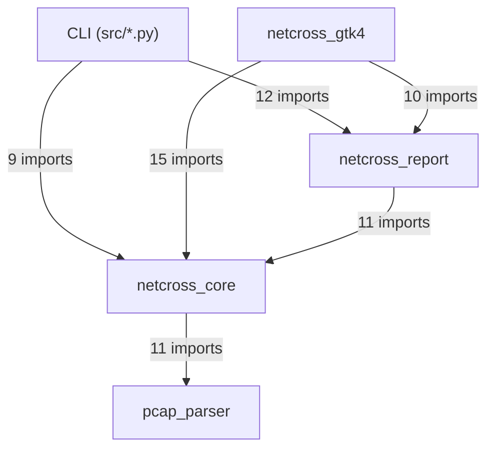
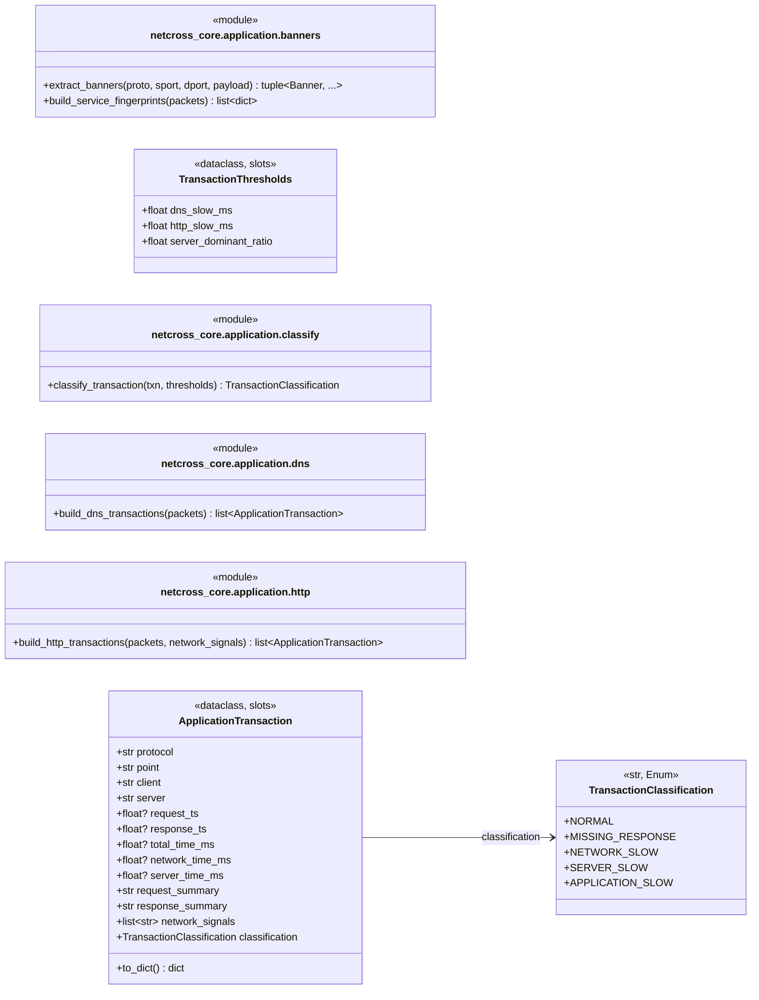
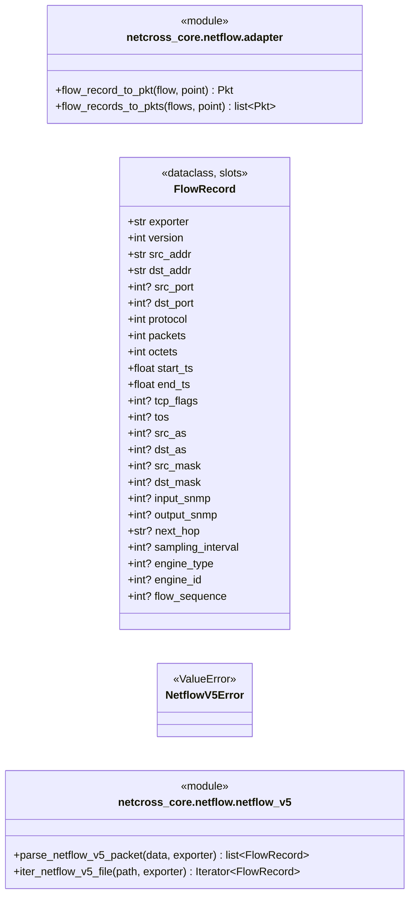
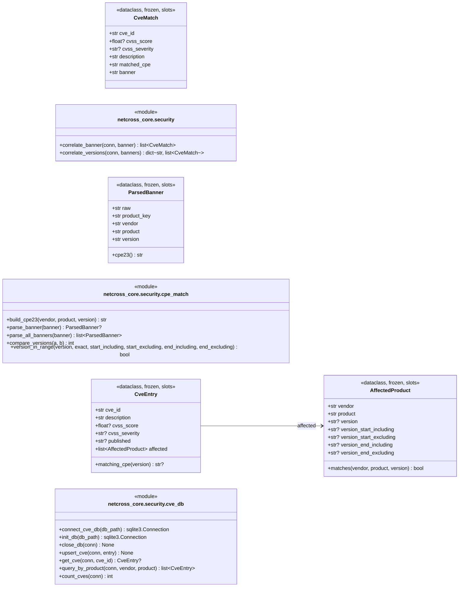
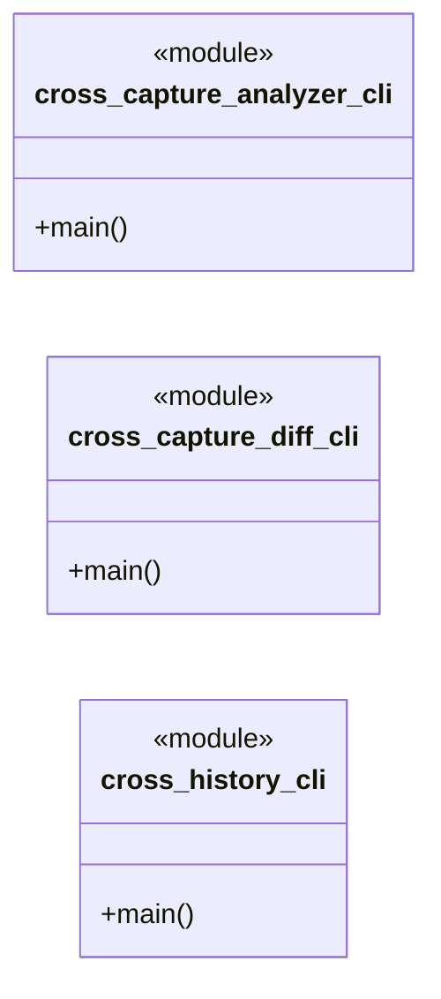

<!-- FICHIER GENERE par scripts/generate_class_diagram.py -- NE PAS EDITER A LA MAIN. -->
<!-- Regenere par le hook pre-commit `class-diagram` ; voir .pre-commit-config.yaml. -->

# netcross — diagramme de classes

> ⚠️ **Fichier généré depuis le code** (`src/`) par `scripts/generate_class_diagram.py` : toute
> modification manuelle sera écrasée. Il est mis à jour automatiquement par le hook pre-commit
> `class-diagram` dès qu'un fichier `src/**/*.py` change ; pour le régénérer à la main :
> `python3 scripts/generate_class_diagram.py` (ou `--check` pour vérifier qu'il est à jour).
>
> Il remplace l'ancienne section 3 de `docs/features-backlog.md`, tenue à la main, qui avait dérivé
> (voir `docs/sessions/session-36.md`, issue #140).

83 modules · 109 classes · 230 fonctions publiques de module.

Conventions : `+` public, `-` privé (préfixe `_`) ; `int?` = `int | None` ; `list~str~` = `list[str]` ;
`<<module>>` regroupe les fonctions publiques d'un module ; `A --> B : champ` = `A` a un champ annoté
avec `B` ; `<<…>>` liste le type de classe (dataclass, `__slots__`…) et les bases hors du bloc.
Les fonctions/méthodes privées (préfixe `_`) et les classes imbriquées ne sont pas représentées.

## Dépendances entre packages

Nombre d'instructions `import` d'un package vers un autre (contrat de couches vérifié par
`import-linter` : `netcross_gtk4 → netcross_report → netcross_core → pcap_parser`).



## `pcap_parser`

| Module | Rôle |
|---|---|
| `pcap_parser` | decodage de captures reseau via tshark -T ek (moteur Wireshark en ligne de commande). |
| `pcap_parser.capfile` | couche 1 bis : cadrage binaire minimal des fichiers pcap / pcapng. |
| `pcap_parser.capture` | couche 6 (orchestration) : point d'entree public du package. |
| `pcap_parser.ek_fields` | couche 2 : acces bas niveau aux champs d'un paquet EK. |
| `pcap_parser.ek_source` | couche 1 : execution de tshark -T ek et lecture du flux NDJSON qui en resulte, fichier pcap ou interface live. |
| `pcap_parser.packet` | couche 5 : assemblage d'un RawPacket normalise a partir des couches EK d'un paquet, une fois l'encapsulation detectee (tunnels.py) et les protocoles applicatifs extraits (protocols.py). |
| `pcap_parser.protocols` | couche 4 : RTP / DHCP / SIP. |
| `pcap_parser.tunnels` | couche 3 : detection de la pile d'encapsulation (VLAN/MPLS/GRE/VXLAN/GTP-U/ERSPAN/CAPWAP) et selection de la couche IP/TCP/UDP/ICMP la plus interne a utiliser pour l'analyse. |

### Diagramme



```mermaid
classDiagram
    direction LR

    %% ===== pcap_parser.capfile =====
    class _SegmentSink {
        +is_open() bool
        +write(raw, is_packet) None
        +write_if_open(raw) None
        +close() None
        +abort() None
    }
    class mod_pcap_parser_capfile["pcap_parser.capfile"] {
        <<module>>
        +detect_format(path) str?
        +format_extension(fmt) str
        +has_packets(path) bool
        +split_by_size(path, out_prefix, max_bytes) list~str~
    }

    %% ===== pcap_parser.capture =====
    class CaptureRingBuffer {
        +files() tuple~str, ...~
        +current_path() str?
        +rotate(now) str
        +maybe_rotate(now) str?
    }
    class TcpreplayNotFoundError {
        <<RuntimeError>>
    }
    class TcpreplayError {
        <<RuntimeError>>
    }
    class mod_pcap_parser_capture["pcap_parser.capture"] {
        <<module>>
        +parse_capture(path, raise_on_error) list~RawPacket~
        +parse_captures_parallel(captures, max_workers) tuple~list~RawPacket~, list~dict~~
        +iter_live(interface, bpf_filter, stop_event) Iterator~RawPacket~
        +merge_captures(paths, output_path, dedup) None
        +replay_capture(path, interface, speed, loop) None
        +split_capture(path, output_dir, by, value) list~str~
    }

    %% ===== pcap_parser.ek_fields =====
    class mod_pcap_parser_ek_fields["pcap_parser.ek_fields"] {
        <<module>>
        +layer(layers, key) dict?
        +innermost(layers, key) dict?
        +all_occurrences(layers, key) list~dict~
        +g(d, name, default) Any
        +as_int(value, base) int?
        +hex_or_dec_to_int(value) int?
        +as_float(value) float?
        +as_bool(value) bool
        +has_expert_flag(layer, name) bool
        +expert_flag_names(layer) tuple~str, ...~
        +expert_flag_details(layer) tuple~tuple~str, str?, str?, str?~, ...~
        +as_bytes_from_hex_dump(value) bytes
    }

    %% ===== pcap_parser.ek_source =====
    class TsharkNotFoundError {
        <<RuntimeError>>
    }
    class TsharkError {
        <<RuntimeError>>
    }
    class EkRecord {
        <<dataclass>>
        +float ts
        +dict layers
    }
    class mod_pcap_parser_ek_source["pcap_parser.ek_source"] {
        <<module>>
        +iter_ek_records(path, interface, bpf_filter, display_filter, extra_prefs, extra_args, lua_scripts, stop_event) Iterator~EkRecord~
    }

    %% ===== pcap_parser.packet =====
    class RawPacket {
        <<dataclass, slots>>
        +float ts
        +int? frame_number
        +str proto
        +str src
        +str dst
        +int? sport
        +int? dport
        +int length
        +int? ttl
        +int? dscp
        +int? ecn
        +int? seq
        +int? ack
        +int? window
        +str? flags
        +int? key_id
        +str? payload_hash
        +bytes payload
        +int? ip_id
        +bool is_fragment
        +bool df
        +bool is_retransmission
        +bool is_fast_retransmission
        +bool is_spurious_retransmission
        +int? mss_val
        +int? wscale_shift
        +bool sack_permitted
        +int? icmp_type
        +int? icmp_code
        +int? icmpv6_type
        +int? icmpv6_code
        +int? arp_opcode
        +str? arp_sender_mac
        +bool arp_is_gratuitous
        +int? stp_bpdu_type
        +bool stp_flags_tc
        +str? stp_root_id
        +str? tls_cert_not_before
        +str? tls_cert_not_after
        +tuple~str, ...~? tls_cert_san
        +str? tls_cert_serial
        +bool tls_client_hello
        +bool tls_server_hello
        +bool tls_application_data
        +int? vlan_id
        +int? vlan_prio
        +bool is_rtp
        +int? rtp_seq
        +int? rtp_ts
        +int? rtp_ssrc
        +tuple~str, ...~ encap_tags
        +int? dhcp_xid
        +str? dhcp_msg_type
        +str? dhcp_server_id
        +str? dhcp_vendor_class
        +str? sip_call_id
        +str? sip_msg_type
        +str? sip_cseq
        +str? sip_user_agent
        +str? sip_server
        +int? dns_txn_id
        +bool dns_is_response
        +str? dns_qry_name
        +int? dns_rcode
        +bool http_is_request
        +bool http_is_response
        +str? http_method
        +str? http_uri
        +int? http_status_code
        +float? http_response_time_ms
        +tuple~str, ...~ expert_flags
        +tuple~tuple~str, str?, str?, str?~, ...~ expert_details
        +str? http_content_type
        +int? http_content_length
        +int? tcp_len
    }
    class mod_pcap_parser_packet["pcap_parser.packet"] {
        <<module>>
        +build_packet(ts_seconds, layers) RawPacket?
    }

    %% ===== pcap_parser.protocols =====
    class mod_pcap_parser_protocols["pcap_parser.protocols"] {
        <<module>>
        +extract_rtp(layers, udp_payload) dict?
        +extract_dhcp(layers) dict?
        +extract_sip(layers, payload) dict?
        +extract_dns(layers) dict?
        +extract_http(layers) dict?
        +extract_tls_certificate(layers) dict?
        +extract_tls_handshake(layers) dict?
        +compute_mos(delay_ms, loss_pct)
    }

    %% ===== pcap_parser.tunnels =====
    class mod_pcap_parser_tunnels["pcap_parser.tunnels"] {
        <<module>>
        +is_tunnel(layers) bool
        +detect_encapsulation(layers) tuple~str, ...~
        +select_innermost_layers(layers) dict
    }
```

## `netcross_core`

| Module | Rôle |
|---|---|
| `netcross_core` | moteur d'analyse croisee de captures Wireshark multi-points, sans dependance a une interface (CLI, GTK4, PDF...). |
| `netcross_core.alarms` | alarmes et surveillance de seuils en analyse live (§6.16, Session 11). |
| `netcross_core.analysis` | coeur analytique : construit un Report a partir des flux correles (pertes, latence, TTL/topologie, QoS, fragmentation, saturation/bufferbloat, TCP avance, VLAN, decalage d'horloge, RTP, decomposition… |
| `netcross_core.baseline_diff` | compare deux Report (avant/apres un correctif, site A / site B, ou toute paire de scenarios comparables) et produit des constats de regression/amelioration. |
| `netcross_core.baseline_profile` | profil de reference dynamique construit a partir de l'historique SQLite (Job 12/issue #9, section 8.5 de FEATURES.md). |
| `netcross_core.causality` | moteur de correlation causale (Session 3 de la section 13.3 de FEATURES.md, Job 4/issue #4). |
| `netcross_core.client_diff` | comparaison "client vs client" : meme capture, memes points, seule la source (l'IP du poste) change. |
| `netcross_core.compliance` | evaluateur de conformite, huitieme et neuvieme objets de contrat de la Session 0 (FEATURES.md section 13.3) : `ReferenceProfile`/`ComplianceResult` (netcross_core.expert_model). |
| `netcross_core.content` | Extraction des objets applicatifs HTTP/1.x sans conservation du corps. |
| `netcross_core.correlate` | correlation des paquets entre points de capture (par 5-tuple strict ou par hash de payload en mode NAT-tolerant) et calcul du debit par fenetre temporelle. |
| `netcross_core.expert_model` | objets de contrat partages entre netcross_core et netcross_report ("Session 0" de FEATURES.md section 13.3 : stabiliser les objets communs avant de batir le moteur d'expertise vise par la comparaison… |
| `netcross_core.expert_rules` | bibliotheque de regles d'expertise reseau DECLARATIVE (FEATURES.md section 6.2), dernier chantier de la Session 2 de la section 13.3 ("moteur d'evenements d'expertise") apres la cloture cote… |
| `netcross_core.exploit_signatures` | detection PASSIVE de signatures d'exploits CVE connus (Log4Shell, Shellshock, Heartbleed, EternalBlue, compression TLS/CRIME) dans la charge utile brute des paquets. |
| `netcross_core.flow_timeline` | vue temporelle detaillee d'un flux (Job 13/issue #10, section 6.4 de FEATURES.md). |
| `netcross_core.flow_view` | vue enrichie d'un flux (FlowView), sixieme objet de contrat de la Session 0 (Job 9/issue #6, section 6.4 et 6.14 de FEATURES.md). |
| `netcross_core.forensic` | index de correlation bidirectionnel evenement ↔ flow ↔ paquet (Job 8/issue #5, §6.3 et §6.14 de FEATURES.md). |
| `netcross_core.forensic_search` | moteur de recherche analytique post-capture transversal (Job 17 / issue #16, section 6.13 de FEATURES.md). |
| `netcross_core.live_diff` | Capture en continu + diff en direct (Job 33, issue #33). |
| `netcross_core.models` | structures de donnees partagees : un paquet normalise (Pkt) et le resultat d'analyse consolide (Report). |
| `netcross_core.naming` | table locale de correspondance adresse/MAC -> nom logique, type, contexte (Job 18 / issue #16-bis, section 6.15 de FEATURES.md). |
| `netcross_core.parsing` | adaptateur entre pcap_parser (decodage via tshark -T ek) et le modele Pkt de netcross_core. |
| `netcross_core.quic_diagnostics` | extraction du SNI des paquets QUIC Initial (RFC 9000/9001), pour voir le trafic HTTP/3 moderne (Chrome, Teams, Meet, WhatsApp...) que le reste de l'outil ne voit aujourd'hui qu'en UDP brut. |
| `netcross_core.redact` | anonymisation des adresses (IP/MAC) d'une liste de paquets deja chargee, en vue d'un partage externe (ticket support vendeur, rapport transmis a un tiers) sans exposer l'adressage reel du reseau du… |
| `netcross_core.report_text` | mise en forme du Report en sortie texte console et en CSV de detail. |
| `netcross_core.stats` | Exploration statistique interactive (Job 27 / issue #22, section 6.8). |
| `netcross_core.tls_diagnostics` | extrait l'etat des handshakes TLS (ClientHello/ServerHello/Alert/donnees applicatives) a chaque point de capture et localise le segment ou un handshake qui reussissait en amont se met a echouer. |
| `netcross_core.voip` | Analyse VoIP orientee appel. |
| `netcross_core.wireshark_expert` | Session 1 de FEATURES.md section 13.3 ("exploitation de l'expertise Wireshark/TShark") : convertit les signaux d'expertise BRUTS deja produits par le moteur de dissection de tshark (champs… |

### Diagramme

```mermaid
classDiagram
    direction LR

    %% ===== netcross_core.alarms =====
    class AlarmSignal {
        <<dataclass, frozen>>
        +str rule_id
        +str segment
        +str severity
        +float? value
    }
    class AlarmConfig {
        <<dataclass>>
        +str rule_id
        +str? segment
        +float window_seconds
        +float min_persistence_seconds
        +float min_sample_ratio
        +float? trigger_threshold
        +float? clear_threshold
    }
    class AlarmEvent {
        <<dataclass>>
        +str rule_id
        +str segment
        +str state
        +float timestamp
        +str message
    }
    class _SegmentState {
        <<dataclass>>
        +list~tuple~float, bool~~ samples
        +float? active_since
        +bool alarmed
    }
    class AlarmEngine {
        +events() list~AlarmEvent~
        +active_alarms() list~AlarmEvent~
        +feed(timestamp, signals) list~AlarmEvent~
    }

    %% ===== netcross_core.analysis =====
    class mod_netcross_core_analysis["netcross_core.analysis"] {
        <<module>>
        +analyse(flows, points_order, all_packets, bucket_seconds, nat_tolerant, rtp_clock_rate, topn, idle_timeout_seconds, exclude_duplicates, duplicate_counts)
    }

    %% ===== netcross_core.baseline_diff =====
    class DiffFinding {
        <<dataclass>>
        +str severity
        +str category
        +str segment
        +str message
        +float? before
        +float? after
        +int? sample_size
        +list~EvidenceLink~ evidence
    }
    class mod_netcross_core_baseline_diff["netcross_core.baseline_diff"] {
        <<module>>
        +diff_reports(baseline, current, loss_min_pp, latency_min_ms) list~DiffFinding~
        +print_diff_report(findings) None
        +write_diff_csv(findings, path) None
    }

    %% ===== netcross_core.baseline_profile =====
    class BaselineProfile {
        <<dataclass>>
        +str metric
        +int count
        +float mean
        +float median
        +dict~str, float~ percentiles
        +float variance
        +float std
        +float min
        +float max
        +list~float~ values
    }
    class mod_netcross_core_baseline_profile["netcross_core.baseline_profile"] {
        <<module>>
        +build_baseline_profile(metric, values) BaselineProfile
        +load_baseline_from_db(db_path, metric, label, limit) BaselineProfile?
        +load_all_baselines(db_path, label, limit) list~BaselineProfile~
    }

    %% ===== netcross_core.causality =====
    class mod_netcross_core_causality["netcross_core.causality"] {
        <<module>>
        +correlate_event_causes(events) list~ExpertEvent~
        +correlate_diagnosis_causes(diagnoses) list~Diagnosis~
    }

    %% ===== netcross_core.client_diff =====
    class ClientSignature {
        <<dataclass>>
        +Counter dhcp_vendor_classes
        +Counter sip_user_agents
    }
    class ClientReport {
        <<dataclass>>
        +str client
        +tuple~str, ...~ ips
        +int packet_count
        +Report report
        +ClientSignature signature
    }
    class ClientComparisonResult {
        <<dataclass>>
        +str reference
        +dict~str, ClientReport~ clients
        +dict~str, list~ diffs
    }
    class mod_netcross_core_client_diff["netcross_core.client_diff"] {
        <<module>>
        +group_packets_by_client(all_packets, client_group)
        +build_client_report(client, ips, packets, points_order, bucket_seconds, nat_tolerant, nat_window_ms, rtp_clock_rate)
        +compare_clients(all_packets, client_group, reference, points_order, bucket_seconds, nat_tolerant, nat_window_ms, rtp_clock_rate, loss_min_pp, latency_min_ms)
        +print_client_comparison(result) None
        +write_client_diff_csv(result, path) None
    }

    %% ===== netcross_core.compliance =====
    class mod_netcross_core_compliance["netcross_core.compliance"] {
        <<module>>
        +evaluate_compliance(report, references) list~ComplianceResult~
    }

    %% ===== netcross_core.content =====
    class HttpObject {
        <<dataclass, frozen>>
        +str point
        +str src
        +int? sport
        +str dst
        +int? dport
        +str? method
        +str? uri
        +int? status_code
        +str? content_type
        +int? content_length
        +float? response_time_ms
        +int? request_frame
        +int? response_frame
        +str? response_payload_hash
        +volume_bytes() int
        +flow() tuple
    }
    class mod_netcross_core_content["netcross_core.content"] {
        <<module>>
        +extract_http_objects(packets, privacy_mode, max_objects) list~HttpObject~
        +objects_to_dicts(objects) list~dict~
    }

    %% ===== netcross_core.correlate =====
    class mod_netcross_core_correlate["netcross_core.correlate"] {
        <<module>>
        +flow_key(pk, nat_tolerant, nat_window_ms)
        +correlate(all_packets, nat_tolerant, nat_window_ms, exclude_duplicates)
        +build_flows(flows) list~Flow~
        +build_conversations(flow_list) list~Conversation~
        +compute_throughput(all_packets, bucket_seconds)
        +compute_topn_series(all_packets, bucket_seconds, dimension, top_n)
    }

    %% ===== netcross_core.expert_model =====
    class PacketEvidence {
        <<dataclass>>
        +str point
        +int frame_number
    }
    class EvidenceLink {
        <<dataclass>>
        +str point
        +str text
        +PacketEvidence? packet
    }
    class Flow {
        <<dataclass>>
        +tuple key
        +list~str~ points
        +dict~str, int~ packet_count
        +dict~str, int~ byte_count
        +dict~str, float~ first_ts
        +dict~str, float~ last_ts
        +tuple~str, str~? endpoints
    }
    class Conversation {
        <<dataclass>>
        +tuple~str, str~ endpoints
        +list~tuple~ flow_keys
        +int packet_count
        +int byte_count
    }
    class ExpertEvent {
        <<dataclass>>
        +str category
        +str severity
        +str segment
        +str message
        +list~EvidenceLink~ evidence
        +str? cause
        +str? impact
        +str source
        +float? confidence
        +float? first_seen
        +float? last_seen
        +str? layer
        +str? protocol
        +list~tuple~ flow_keys
        +list~PacketEvidence~ packet_evidence
        +str? remediation
        +str? rule_id
    }
    class Diagnosis {
        <<dataclass>>
        +str segment
        +list~ExpertEvent~ events
        +str? cause
        +str? impact
    }
    class ReferenceProfile {
        <<dataclass>>
        +str id
        +str metric
        +str operator
        +float threshold
        +str unit
        +str source
        +str provenance
        +str? version
        +str? context
        +float? percentile
        +str confidence
        +float? deviation_margin
    }
    class ComplianceResult {
        <<dataclass>>
        +ReferenceProfile reference
        +float? observed
        +str status
    }

    %% ===== netcross_core.expert_rules =====
    class Rule {
        <<dataclass>>
        +str id
        +str domain
        +str preconditions
        +tuple~str, ...~ required_metrics
        +str time_window
        +str required_context
        +str severity
        +float confidence
        +str explanation
        +str verification_leads
        +dict~str, float~ thresholds
        +str? correlation_rule
    }
    class mod_netcross_core_expert_rules["netcross_core.expert_rules"] {
        <<module>>
        +get_rule(rule_id) Rule?
        +list_rules(domain) list~Rule~
    }

    %% ===== netcross_core.exploit_signatures =====
    class SignatureError {
        <<ValueError>>
    }
    class PacketLike {
        <<Protocol>>
        +float ts
        +int? frame_number
        +str proto
        +str src
        +str dst
        +int? sport
        +int? dport
        +bytes payload
        +str? payload_hash
    }
    class Signature {
        <<dataclass, frozen>>
        +str id
        +str name
        +tuple~str, ...~ cves
        +str severity
        +str description
        +tuple~str, ...~ targets
        +re.Pattern~str~? regex
        +bytes? hex_bytes
        +tuple~str, ...~ normalizers
        +str? detector
        +dict~str, Any~ params
        +tuple~str, ...~ protocols
        +tuple~int, ...~ ports
        +tuple~str, ...~ references
    }
    class Detection {
        <<dataclass, frozen>>
        +str signature_id
        +str name
        +tuple~str, ...~ cves
        +str severity
        +str target
        +float ts
        +int? frame_number
        +str proto
        +str src
        +int? sport
        +str dst
        +int? dport
        +str? payload_hash
        +str evidence
        +str point
    }
    class _FlowState {
        <<dataclass, slots>>
        +bool tls_ccs_seen
        +bool smb_mid64_tree_connect
    }
    class _Detector {
        <<dataclass, frozen>>
        +Callable~(bytes, _FlowState, dict~str, Any~), str?~ run
        +Callable~(dict~str, Any~), None~ validate
    }
    class _HttpRequest {
        <<dataclass, frozen>>
        +str uri
        +tuple~tuple~str, str~, ...~ headers
        +str body
    }
    class _PayloadView {
        +text(target, normalizers) str?
    }
    class ExploitScanner {
        +scan_packet(pkt, point) list~Detection~
        +scan_packets(packets, point) list~Detection~
    }
    class mod_netcross_core_exploit_signatures["netcross_core.exploit_signatures"] {
        <<module>>
        +available_detectors() tuple~str, ...~
        +parse_signatures(data) list~Signature~
        +load_signatures(paths) list~Signature~
        +detect_exploits(packets, signatures, point) list~Detection~
        +detections_to_dicts(detections) list~dict~str, Any~~
    }

    %% ===== netcross_core.flow_timeline =====
    class PacketTiming {
        <<dataclass>>
        +float ts
        +str point
        +float delta_ms
        +int cumulative_bytes
    }
    class ThroughputWindow {
        <<dataclass>>
        +float start_ts
        +float end_ts
        +int bytes
        +float bps
    }
    class FlowTimeline {
        <<dataclass>>
        +list~PacketTiming~ packet_timings
        +list~ThroughputWindow~ throughput_windows
        +dict~str, float~ inter_arrival_stats
        +list~str~ phases
        +float? rtt_estimate_ms
    }
    class mod_netcross_core_flow_timeline["netcross_core.flow_timeline"] {
        <<module>>
        +build_flow_timeline(packets, window_s) FlowTimeline
    }

    %% ===== netcross_core.flow_view =====
    class TcpSummary {
        <<dataclass>>
        +int retransmissions
        +int fast_retransmissions
        +int spurious_retransmissions
        +bool syn_seen
        +bool fin_seen
        +bool rst_seen
        +int? mss
        +int? wscale
        +bool sack_permitted
    }
    class Transaction {
        <<dataclass>>
        +str kind
        +float? request_ts
        +float? response_ts
        +float? response_time_ms
        +str detail
    }
    class FlowView {
        <<dataclass>>
        +Flow flow
        +float duration_s
        +int packet_count
        +int byte_count
        +float throughput_bps
        +dict~str, float~ first_ts_by_point
        +dict~str, float~ inter_point_latency_ms
        +TcpSummary tcp
        +list~Transaction~ transactions
        +list~ExpertEvent~ events
        +list~tuple~float, str, str~~ timeline
    }
    class mod_netcross_core_flow_view["netcross_core.flow_view"] {
        <<module>>
        +build_flow_view(flow, packets_by_point, events) FlowView
    }

    %% ===== netcross_core.forensic =====
    class ForensicIndex {
        +event_to_flows(event) list~Flow~
        +event_to_packets(event) list~PacketEvidence~
        +packet_to_flow(point, frame_number) Flow?
        +flow_to_events(flow) list~ExpertEvent~
        +flow_to_packets(flow) list~Pkt~
    }
    class mod_netcross_core_forensic["netcross_core.forensic"] {
        <<module>>
        +detect_cross_capture_duplicates(packets, threshold_ms) dict~tuple~str, str~, int~
        +annotations_sidecar_path(capture_path) str
        +read_annotations(capture_path) list~PacketAnnotation~
        +write_annotations(capture_path, annotations) None
        +annotations_by_tag(annotations) dict~str, list~PacketAnnotation~~
    }

    %% ===== netcross_core.forensic_search =====
    class ForensicSearchQuery {
        <<dataclass, frozen>>
        +str? text
        +str? point
        +str? protocol
        +str? address
        +int? port
        +float? time_start
        +float? time_end
        +str? field
        +str? field_value
    }
    class ForensicSearchResult {
        <<dataclass, frozen>>
        +str kind
        +str? point
        +int? frame_number
        +float? ts
        +tuple~str, ...~ matched_fields
        +str snippet
    }
    class _SearchDoc {
        <<dataclass>>
        +str kind
        +str? point
        +int? frame_number
        +float? ts
        +str? src
        +str? dst
        +int? sport
        +int? dport
        +str? protocol
        +dict~str, str~ fields
        +str text
    }
    class ForensicSearchIndex {
        +search(query) list~ForensicSearchResult~
    }

    %% ===== netcross_core.live_diff =====
    class LiveDiffConfig {
        <<dataclass, frozen>>
        +float eval_interval_seconds
        +float window_seconds
        +int max_packets_per_window
        +int min_packets_for_diff
    }
    class LiveDiffState {
        <<dataclass>>
        +bool running
        +list~Pkt~ packets_in_window
        +float last_eval_ts
        +int last_diff_count
        +int total_evaluations
    }
    class LiveDiffEngine {
        +start(interface, bpf_filter) None
        +stop(timeout) None
    }
    class mod_netcross_core_live_diff["netcross_core.live_diff"] {
        <<module>>
        +finding_to_alarm_signal(finding, segment) AlarmSignal
    }

    %% ===== netcross_core.models =====
    class Banner {
        <<dataclass, frozen, slots>>
        +str protocol
        +str service
        +str? version
        +str raw
        +str role
        +banner() str
    }
    class Pkt {
        <<dataclass, slots>>
        +str point
        +float ts
        +int? frame_number
        +str proto
        +str src
        +str dst
        +int? sport
        +int? dport
        +int length
        +int? ttl
        +int? dscp
        +int? ecn
        +int? seq
        +int? ack
        +int? window
        +str? flags
        +int? key_id
        +str? payload_hash
        +int? ip_id
        +bool is_fragment
        +bool df
        +bool is_retransmission
        +bool is_fast_retransmission
        +bool is_spurious_retransmission
        +int? mss_val
        +int? wscale_shift
        +bool sack_permitted
        +int? icmp_type
        +int? icmp_code
        +int? icmpv6_type
        +int? icmpv6_code
        +int? arp_opcode
        +str? arp_sender_mac
        +bool arp_is_gratuitous
        +int? stp_bpdu_type
        +bool stp_flags_tc
        +str? stp_root_id
        +str? tls_cert_not_before
        +str? tls_cert_not_after
        +tuple~str, ...~? tls_cert_san
        +str? tls_cert_serial
        +bool tls_client_hello
        +bool tls_server_hello
        +bool tls_application_data
        +int? vlan_id
        +int? vlan_prio
        +bool is_rtp
        +int? rtp_seq
        +int? rtp_ts
        +int? rtp_ssrc
        +tuple~str, ...~ encap_tags
        +int? dhcp_xid
        +str? dhcp_msg_type
        +str? dhcp_server_id
        +str? dhcp_vendor_class
        +str? sip_call_id
        +str? sip_msg_type
        +str? sip_cseq
        +str? sip_user_agent
        +str? sip_server
        +int? dns_txn_id
        +bool dns_is_response
        +str? dns_qry_name
        +int? dns_rcode
        +bool http_is_request
        +bool http_is_response
        +str? http_method
        +str? http_uri
        +int? http_status_code
        +float? http_response_time_ms
        +tuple~str, ...~ expert_flags
        +tuple~tuple~str, str?, str?, str?~, ...~ expert_details
        +str? http_content_type
        +int? http_content_length
        +bool is_duplicate
        +tuple~Banner, ...~ service_banners
        +int? tcp_len
    }
    class SequenceGap {
        <<dataclass, slots>>
        +str point
        +str src
        +int sport
        +str dst
        +int dport
        +int start_seq
        +int end_seq
        +int missing_bytes
        +float ts
        +int? frame_number
        +str cause
        +str evidence
    }
    class Report {
        <<dataclass>>
        +list~str~ points
        +list~tuple~str, str~~ pairs
        +float bucket_seconds
        +int rtp_clock_rate
        +dict~str, int~ seen_count
        +dict~str, int~ loss_count
        +dict~tuple~str, str~, list~float~~ latency
        +dict~tuple~str, str~, int~ qos_change
        +dict~str, int~ retrans
        +dict~str, int~ retrans_fast
        +dict~str, int~ retrans_rto
        +dict~str, int~ retrans_spurious
        +dict~tuple~str, str~, int~ mss_clamped
        +dict~tuple~str, str~, list~str~~ mss_clamped_examples
        +dict~tuple~str, str~, list~int?~~ mss_clamped_frames
        +dict~tuple~str, str~, int~ wscale_stripped
        +dict~tuple~str, str~, int~ sack_stripped
        +dict~tuple~str, str~, list~int~~ hop_delta
        +dict~tuple~str, str~, int~ hop_delta_outliers
        +dict~str, int~ ttl_unstable
        +dict~tuple~str, str~, int~ qos_l2_remark
        +dict~tuple~str, str~, int~ qos_l3_remark
        +dict~str, int~ frag_count
        +dict~tuple~str, str~, int~ frag_new
        +dict~str, int~ icmp_frag_needed
        +dict~str, int~ icmpv6_too_big
        +dict~tuple~str, str~, int~ pmtud_blackhole
        +dict~tuple~str, str~, list~str~~ pmtud_blackhole_examples
        +dict~tuple~str, str~, list~int?~~ pmtud_blackhole_frames
        +dict~tuple~str, str~, int~ idle_timeout_dropped
        +dict~tuple~str, str~, list~str~~ idle_timeout_examples
        +dict~tuple~str, str~, list~int?~~ idle_timeout_frames
        +dict~str, int~ arp_ip_conflict
        +dict~str, list~str~~ arp_ip_conflict_examples
        +dict~str, list~int?~~ arp_ip_conflict_frames
        +dict~str, int~ stp_topology_change
        +dict~str, int~ stp_root_change
        +dict~str, list~str~~ stp_root_change_examples
        +dict~str, list~int?~~ stp_root_change_frames
        +dict~str, int~ tls_cert_invalid_dates
        +dict~str, list~str~~ tls_cert_invalid_dates_examples
        +dict~str, list~int?~~ tls_cert_invalid_dates_frames
        +dict~tuple~str, str~, int~ tls_cert_mismatch
        +dict~tuple~str, str~, list~str~~ tls_cert_mismatch_examples
        +dict~tuple~str, str~, list~int?~~ tls_cert_mismatch_frames
        +dict~str, int~ tls_handshake_no_reply
        +dict~str, list~str~~ tls_handshake_no_reply_examples
        +dict~str, list~int?~~ tls_handshake_no_reply_frames
        +dict~str, int~ tls_handshake_incomplete
        +dict~str, list~str~~ tls_handshake_incomplete_examples
        +dict~str, list~int?~~ tls_handshake_incomplete_frames
        +dict~str, dict~int, int~~ throughput
        +dict~str, dict~str, dict~str, dict~int, int~~~~ topn_timeseries
        +dict~tuple~str, str~, list~int~~ loss_event_buckets
        +dict~tuple~str, str~, dict~int, list~float~~~ latency_by_bucket
        +dict~tuple~str, str~, str~ saturation_verdict
        +dict~tuple~str, str~, tuple~float, float~~ bufferbloat_hint
        +dict~str, int~ zero_window
        +dict~str, int~ dup_ack
        +dict~str, int~ out_of_order
        +dict~str, int~ lost_segment
        +dict~str, int~ window_update
        +dict~str, int~ rst_count
        +dict~str, int~ rst_localized
        +dict~str, int~ syn_no_synack
        +dict~str, int~ syn_reply_missing
        +list~SequenceGap~ sequence_gaps
        +dict~tuple~str, str~, list~float~~ clock_offset_samples
        +dict~tuple~str, str~, tuple~float, float, int~~ clock_offset_estimate
        +dict~str, set~int~~ vlan_seen
        +dict~tuple~str, str~, int~ vlan_change
        +dict~tuple~str, str~, dict~str, int~~ vlan_tag_flip
        +dict~tuple~str, str~, int~ pcp_change
        +dict~str, set~str~~ encap_seen
        +dict~tuple~str, str~, int~ encap_change
        +dict~tuple~str, str~, list~str~~ encap_change_examples
        +dict~tuple~str, str~, int~ encap_frag_correlated
        +list~dict~ rtp_streams
        +list~dict~ voip_calls
        +dict~str, int~ voip_quality_distribution
        +dict~str, list~float~~ server_think_time
        +dict~str, dict~str, int~~ dhcp_msg_count
        +dict~str, int~ dhcp_nak_count
        +dict~str, set~str~~ dhcp_server_seen
        +dict~tuple~str, str~, list~str~~ dhcp_missing
        +list~float~ dhcp_duration_ms
        +dict~str, dict~str, int~~ sip_msg_count
        +dict~str, set~str~~ sip_agents_seen
        +dict~tuple~str, str~, list~str~~ sip_missing
        +list~float~ sip_setup_duration_ms
        +list~str~ sip_failed_calls
        +dict~str, int~ dns_query_count
        +dict~str, int~ dns_response_count
        +dict~str, int~ dns_nxdomain_count
        +dict~str, int~ dns_servfail_count
        +dict~tuple~str, str~, list~str~~ dns_missing
        +dict~str, list~str~~ dns_timeout
        +dict~str, list~int?~~ dns_timeout_frames
        +list~float~ dns_duration_ms
        +dict~str, int~ http_request_count
        +dict~str, int~ http_response_count
        +dict~str, dict~str, int~~ http_status_count
        +dict~str, int~ http_client_error_count
        +dict~str, int~ http_server_error_count
        +dict~str, list~str~~ http_error_examples
        +dict~str, list~int?~~ http_error_frames
        +dict~tuple~str, str~, list~str~~ http_missing
        +dict~str, list~str~~ http_timeout
        +dict~str, list~int?~~ http_timeout_frames
        +list~float~ http_response_time_ms
        +dict~tuple~str, str~, int~ duplicate_count
        +bool duplicates_excluded
        +list~dict~ http_objects
        +list~dict~ application_transactions
        +list~dict~ service_fingerprints
        +list~dict~ security_findings
        +list~tuple~str, str, dict~~ topology_edges
        +list~tuple~str, str, str~~ topology_ambiguous
        +list~str~ topology_isolated
        +list~str~ topology_branch_points
        +list~str~ topology_merge_points
        +list~str~ topology_order_conflicts
        +bool topology_used_for_order
    }
    class PacketAnnotation {
        <<dataclass, slots>>
        +int frame_number
        +str tag
        +str comment
        +str? color
    }

    %% ===== netcross_core.naming =====
    class NameEntry {
        <<dataclass, frozen>>
        +str name
        +str? address
        +str? mac
        +str type
        +str? site
        +str? role
        +str? comment
        +matches(address, mac) bool
    }
    class NameTable {
        +add(entry) None
        +resolve(address) NameEntry?
        +resolve_mac(mac) NameEntry?
        +display(address) str
        +to_list() list~dict~
        +from_list(items)$ NameTable
        +load(path)$ NameTable
        +save(path) None
    }

    %% ===== netcross_core.parsing =====
    class mod_netcross_core_parsing["netcross_core.parsing"] {
        <<module>>
        +parse_capture(label, path, raise_on_error) list~Pkt~
        +parse_captures_parallel(captures, max_workers) tuple~list~Pkt~, list~dict~~
        +parse_live(label, interface, bpf_filter, stop_event)
        +parse_rtp(payload)
        +parse_sip(payload)
        +detect_encapsulation(layers)
    }

    %% ===== netcross_core.quic_diagnostics =====
    class QuicEvent {
        <<dataclass>>
        +str point
        +float ts
        +str src
        +str dst
        +int sport
        +int dport
        +bytes dcid
        +bool decryptable
        +str? sni
        +str? tls_version
    }
    class mod_netcross_core_quic_diagnostics["netcross_core.quic_diagnostics"] {
        <<module>>
        +derive_initial_secrets(dcid) tuple~bytes, bytes~
        +derive_packet_protection_keys(secret) tuple~bytes, bytes, bytes~
        +parse_quic_capture(label, path) list~QuicEvent~
        +diagnose_quic(events, points_order)
        +print_quic_diagnostics(findings) None
    }

    %% ===== netcross_core.redact =====
    class AddressRedactor {
        +redact(packets) None
        +entries()
        +mapping() dict~str, str~
    }
    class mod_netcross_core_redact["netcross_core.redact"] {
        <<module>>
        +redact_packets(packets) AddressRedactor
        +write_redaction_map_csv(redactor, path) None
    }

    %% ===== netcross_core.report_text =====
    class mod_netcross_core_report_text["netcross_core.report_text"] {
        <<module>>
        +print_report(r)
        +print_annotations(annotations)
        +write_detail_csv(path, flows, points, names)
    }

    %% ===== netcross_core.stats =====
    class StatRow {
        <<dataclass, frozen>>
        +str label
        +str group_by
        +int packets
        +int bytes
        +float duration_ms
        +float throughput_bps
        +float? latency_ms
        +int events
        +list~tuple~ flow_keys
        +duration_s() float
    }
    class StatsQuery {
        <<dataclass, frozen>>
        +str group_by
        +str sort_by
        +int? top_n
        +float? time_start
        +float? time_end
        +str? segment
    }
    class mod_netcross_core_stats["netcross_core.stats"] {
        <<module>>
        +compute_stats(flows, report, all_packets, query, events_by_segment) list~StatRow~
        +export_csv(rows) str
        +export_json(rows) list~dict~
    }

    %% ===== netcross_core.tls_diagnostics =====
    class TlsEvent {
        <<dataclass>>
        +str point
        +float ts
        +str src
        +int sport
        +str dst
        +int dport
        +str record_type
        +str? handshake_type
        +str? sni
        +str? tls_version
        +str? cipher
        +str? alert_level
        +str? alert_description
        +int? record_length
        +bool truncated
    }
    class HandshakeStatus {
        <<dataclass>>
        +str point
        +str flow_id
        +bool client_hello_seen
        +str? sni
        +bool server_hello_seen
        +str? tls_version
        +str? cipher
        +str? fatal_alert
        +str? warning_alert
        +bool application_data_seen
        +float? first_ts
        +float? last_ts
        +verdict() str
    }
    class TlsFinding {
        <<dataclass>>
        +str severity
        +str category
        +str segment
        +str message
    }
    class mod_netcross_core_tls_diagnostics["netcross_core.tls_diagnostics"] {
        <<module>>
        +parse_client_hello(body) dict
        +parse_server_hello(body) dict
        +parse_alert(body) dict
        +parse_tls_capture(label, path) list~TlsEvent~
        +build_handshake_status(events) dict~str, dict~str, HandshakeStatus~~
        +diagnose_tls(status_by_point, points_order) list~TlsFinding~
        +print_tls_diagnostics(findings) None
    }

    %% ===== netcross_core.voip =====
    class Call {
        <<dataclass>>
        +str call_id
        +tuple~str, ...~ participants
        +list~dict~ signaling
        +float? setup_duration_ms
        +float? duration_ms
        +list~dict~ rtp_streams
        +list~dict~ events
        +str quality
        +str correlation_method
        +to_dict() dict
    }
    class mod_netcross_core_voip["netcross_core.voip"] {
        <<module>>
        +build_calls(all_packets, rtp_streams) tuple~list~Call~, dict~str, int~~
    }

    %% ===== netcross_core.wireshark_expert =====
    class mod_netcross_core_wireshark_expert["netcross_core.wireshark_expert"] {
        <<module>>
        +build_wireshark_expert_events(all_packets) list~ExpertEvent~
    }

    %% ===== relations =====
    DiffFinding --> EvidenceLink : evidence
    ClientReport --> ClientSignature : signature
    ClientReport --> Report : report
    ClientComparisonResult --> ClientReport : clients
    EvidenceLink --> PacketEvidence : packet
    ExpertEvent --> EvidenceLink : evidence
    ExpertEvent --> PacketEvidence : packet_evidence
    Diagnosis --> ExpertEvent : events
    ComplianceResult --> ReferenceProfile : reference
    _Detector --> _FlowState : run
    FlowTimeline --> PacketTiming : packet_timings
    FlowTimeline --> ThroughputWindow : throughput_windows
    FlowView --> ExpertEvent : events
    FlowView --> Flow : flow
    FlowView --> TcpSummary : tcp
    FlowView --> Transaction : transactions
    LiveDiffState --> Pkt : packets_in_window
    Pkt --> Banner : service_banners
    Report --> SequenceGap : sequence_gaps
```

## `netcross_core.application`

| Module | Rôle |
|---|---|
| `netcross_core.application` | modele transactionnel applicatif (Job 23, §6.9/§6.10). |
| `netcross_core.application.banners` | extraction passive des bannieres de versions logicielles et construction de `Report.service_fingerprints` (CVE-1, issue #135, parent #133). |
| `netcross_core.application.classify` | classification automatique des transactions applicatives (Job 23, §6.9). |
| `netcross_core.application.dns` | construction de transactions DNS a partir des paquets (Job 23, §6.9). |
| `netcross_core.application.http` | construction de transactions HTTP a partir des paquets (Job 23, §6.10). |
| `netcross_core.application.models` | structures de donnees du modele transactionnel applicatif (Job 23, §6.9/§6.10). |

### Diagramme



## `netcross_core.netflow`

| Module | Rôle |
|---|---|
| `netcross_core.netflow` | ingestion NetFlow/sFlow comme source de donnees alternative aux captures pcap (Job 32, issue #32). |
| `netcross_core.netflow.adapter` | conversion FlowRecord -> Pkt. |
| `netcross_core.netflow.models` | structure de donnees partagee pour un flux agrege NetFlow/sFlow (FlowRecord), distincte de Pkt. |
| `netcross_core.netflow.netflow_v5` | parseur NetFlow v5 (RFC 1568 / format Cisco historique, le plus repandu et le plus simple des protocoles vises par cet ADR -- voir docs/adr/netflow-sflow-architecture.md, Phase 1 du plan… |

### Diagramme



## `netcross_core.security`

| Module | Rôle |
|---|---|
| `netcross_core.security` | detection passive de vulnerabilites (CVE) sur traces reseau (issue #133, sous-tache CVE-4 / issue #138). |
| `netcross_core.security.cpe_match` | conversion d'une banniere de service ("Apache/2.4.41") en identifiant CPE 2.3 et comparaison de versions avec les ranges NVD (versionStart/EndIncluding/Excluding). |
| `netcross_core.security.cve_db` | base SQLite locale des CVE, peuplee par scripts/import_nvd.py depuis le flux NVD (voir ce script pour le format JSON attendu, API NVD 2.0). |

### Diagramme



## `netcross_core.tshark_stats`

| Module | Rôle |
|---|---|
| `netcross_core.tshark_stats` | adaptateurs de statistiques ``tshark -z`` (Job 19 / issue #20, section 6.19 de features-backlog.md). |
| `netcross_core.tshark_stats.conversations` | adaptateur ``tshark -z conv,<proto>``. |
| `netcross_core.tshark_stats.dns` | adaptateur ``tshark -z dns,tree``. |
| `netcross_core.tshark_stats.endpoints` | adaptateur ``tshark -z endpoints,<proto>``. |
| `netcross_core.tshark_stats.http` | adaptateur ``tshark -z http,stat``. |
| `netcross_core.tshark_stats.io_stat` | adaptateur ``tshark -z io,stat``. |
| `netcross_core.tshark_stats.models` | modele commun des statistiques tshark (Job 19 / issue #20, section 6.19 de features-backlog.md). |
| `netcross_core.tshark_stats.parse_utils` | utilitaires de parsing tolerants pour les sorties texte ``tshark -z``. |
| `netcross_core.tshark_stats.protocol_hierarchy` | adaptateur ``tshark -z io,phs``. |
| `netcross_core.tshark_stats.response_time` | adaptateur ``tshark -z <proto>,rtt``. |
| `netcross_core.tshark_stats.runner` | invocation de ``tshark -z``. |

### Diagramme



```mermaid
classDiagram
    direction LR

    %% ===== netcross_core.tshark_stats =====
    class mod_netcross_core_tshark_stats["netcross_core.tshark_stats"] {
        <<module>>
        +collect_conversations(capture_path, protocol) list~ConversationStat~
        +collect_endpoints(capture_path, protocol) list~EndpointStat~
        +collect_protocol_hierarchy(capture_path) list~ProtocolHierarchyStat~
        +collect_io_stat(capture_path, interval, name) MetricSeries
    }

    %% ===== netcross_core.tshark_stats.conversations =====
    class mod_netcross_core_tshark_stats_conversations["netcross_core.tshark_stats.conversations"] {
        <<module>>
        +parse_conversations(text, protocol) list~ConversationStat~
    }

    %% ===== netcross_core.tshark_stats.dns =====
    class mod_netcross_core_tshark_stats_dns["netcross_core.tshark_stats.dns"] {
        <<module>>
        +parse_dns_stat(text, application) list~ApplicationStat~
    }

    %% ===== netcross_core.tshark_stats.endpoints =====
    class mod_netcross_core_tshark_stats_endpoints["netcross_core.tshark_stats.endpoints"] {
        <<module>>
        +parse_endpoints(text, protocol) list~EndpointStat~
    }

    %% ===== netcross_core.tshark_stats.http =====
    class mod_netcross_core_tshark_stats_http["netcross_core.tshark_stats.http"] {
        <<module>>
        +parse_http_stat(text, application) list~ApplicationStat~
    }

    %% ===== netcross_core.tshark_stats.io_stat =====
    class mod_netcross_core_tshark_stats_io_stat["netcross_core.tshark_stats.io_stat"] {
        <<module>>
        +parse_io_stat(text, name) MetricSeries
    }

    %% ===== netcross_core.tshark_stats.models =====
    class MetricPoint {
        <<dataclass, frozen, slots>>
        +float? start
        +float? end
        +dict~str, float~ values
    }
    class netcross_core_tshark_stats_models_MetricSeries["netcross_core.tshark_stats.models.MetricSeries"] {
        <<dataclass, frozen, slots>>
        +str name
        +tuple~MetricPoint, ...~ points
        +dict~str, str~ labels
    }
    class _BaseStat {
        <<dataclass, frozen, slots>>
        +dict~str, str~ raw_fields
    }
    class ConversationStat {
        <<dataclass, frozen, slots>>
        +str protocol
        +str endpoint_a
        +str endpoint_b
        +int? packets_total
        +int? bytes_total
        +int? packets_ab
        +int? bytes_ab
        +int? packets_ba
        +int? bytes_ba
        +float? rel_start
        +float? duration
        +float? bits_per_second
    }
    class EndpointStat {
        <<dataclass, frozen, slots>>
        +str protocol
        +str address
        +int? packets_total
        +int? bytes_total
        +int? packets_out
        +int? bytes_out
        +int? packets_in
        +int? bytes_in
        +float? bits_per_second
    }
    class ProtocolHierarchyStat {
        <<dataclass, frozen, slots>>
        +str protocol
        +int depth
        +int? frame_count
        +int? byte_count
        +float? percent_packets
        +float? percent_bytes
    }
    class ApplicationStat {
        <<dataclass, frozen, slots>>
        +str application
        +dict~str, str~ labels
        +dict~str, float~ metrics
    }
    class ResponseTimeStat {
        <<dataclass, frozen, slots>>
        +str application
        +int? count
        +float? min_ms
        +float? max_ms
        +float? mean_ms
        +float? median_ms
    }

    %% ===== netcross_core.tshark_stats.parse_utils =====
    class mod_netcross_core_tshark_stats_parse_utils["netcross_core.tshark_stats.parse_utils"] {
        <<module>>
        +is_separator(line) bool
        +is_filter_line(line) bool
        +is_title_or_section(line) bool
        +split_fields(line) list~str~
        +parse_int(s) int?
        +parse_float(s) float?
        +normalize_header(s) str
        +find_column(headers, keywords) int?
        +data_rows(text) list~str~
        +header_lines(text) list~str~
        +reconstruct_headers(text) list~str~
        +raw_fields_from(headers, fields) dict~str, str~
    }

    %% ===== netcross_core.tshark_stats.protocol_hierarchy =====
    class mod_netcross_core_tshark_stats_protocol_hierarchy["netcross_core.tshark_stats.protocol_hierarchy"] {
        <<module>>
        +parse_protocol_hierarchy(text) list~ProtocolHierarchyStat~
    }

    %% ===== netcross_core.tshark_stats.response_time =====
    class mod_netcross_core_tshark_stats_response_time["netcross_core.tshark_stats.response_time"] {
        <<module>>
        +parse_response_time(text, application) ResponseTimeStat?
    }

    %% ===== netcross_core.tshark_stats.runner =====
    class TsharkUnavailableError {
        <<RuntimeError>>
    }
    class mod_netcross_core_tshark_stats_runner["netcross_core.tshark_stats.runner"] {
        <<module>>
        +run_tshark_stat(capture_path, z_arg, tshark_bin, timeout, extra_args) str
    }

    %% ===== relations =====
    netcross_core_tshark_stats_models_MetricSeries --> MetricPoint : points
    _BaseStat <|-- ConversationStat
    _BaseStat <|-- EndpointStat
    _BaseStat <|-- ProtocolHierarchyStat
    _BaseStat <|-- ApplicationStat
    _BaseStat <|-- ResponseTimeStat
```

## `netcross_report`

| Module | Rôle |
|---|---|
| `netcross_report` | synthese, triage, et generation de rapports (PDF, JSON) a partir d'un Report netcross_core. |
| `netcross_report.charts` | graphiques matplotlib exportes en PNG pour le PDF. |
| `netcross_report.comm_map` | cartographie des communications observees (Job 15/issue #15, FEATURES.md section 6.6). |
| `netcross_report.expert_events` | construit les vues `ExpertEvent`/ `Diagnosis` (Session 36, cinquieme et sixieme objets de contrat de la Session 0, FEATURES.md section 13.3) a partir d'une liste de `Finding`/ `DiffFinding` deja… |
| `netcross_report.history` | persiste un resume de chaque run (analyse ou diff) dans une base SQLite locale, pour observer une tendance dans le temps (score de sante, nombre de constats par severite) sur des runs successifs --… |
| `netcross_report.json_report` | serialise un Report/DiffFinding en JSON structure, pour l'integration externe (dashboard, ticketing, pipeline CI qui veut parser un resultat sans dependre du format texte console). |
| `netcross_report.metric_charts` | API generique de graphiques : tout module d'analyse peut produire un graphique a partir d'une MetricSeries sans reimplementer son propre code matplotlib. |
| `netcross_report.path_metrics` | metriques de qualite par segment du chemin observe (Job 16/issue #12, FEATURES.md section 6.7). |
| `netcross_report.pdf` | assemble le rapport PDF final (synthese, graphiques, tableaux de detail) a partir d'un Report netcross_core, avec reportlab. |
| `netcross_report.rule_engine` | premier PILOTE du moteur d'EXECUTION evoque comme premier chantier ouvert par CLAUDE.md/`Prochaine feature` depuis la Session 54 (bibliotheque de regles §6.2 complete, 41 regles) : faire evaluer une… |
| `netcross_report.security_report` | rapport de securite consolide et tableau de bord (CVE-5, issue #139, parent #133). |
| `netcross_report.sequence_view` | diagramme de sequence multi-hotes (Job 14/issue #11, FEATURES.md section 6.5). |
| `netcross_report.session_objects` | construction et rendu CONSOLE des objets de contrat de la Session 0 (Job 4/issue #13). |
| `netcross_report.synthesis` | transforme un Report en une liste de constats (Finding) via des regles et seuils explicites. |
| `netcross_report.triage` | agrege les Finding (ou DiffFinding) produits par ailleurs pour repondre a une question que synthesis.py ne pose pas : "par ou je commence a regarder ?" |

### Diagramme



```mermaid
classDiagram
    direction LR

    %% ===== netcross_report.charts =====
    class mod_netcross_report_charts["netcross_report.charts"] {
        <<module>>
        +chart_topology(r, path)
        +chart_throughput(r, path)
        +chart_latency(r, path)
        +chart_loss(r, path)
        +chart_topn_timeseries(r, point, dimension, path)
        +generate_topn_charts(r, tmpdir, point)
        +chart_severity_summary(findings, path, scheme)
        +chart_path_quality(metrics, path)
        +chart_sequence_diagram(view, path)
        +chart_comm_map(cmap, path)
        +generate_all_charts(r, findings, tmpdir)
    }

    %% ===== netcross_report.comm_map =====
    class CommNode {
        <<dataclass>>
        +str host
        +int packets
        +int bytes
        +set protocols
        +int anomalies
    }
    class CommEdge {
        <<dataclass>>
        +str src
        +str dst
        +int packets
        +int bytes
        +set protocols
        +int anomalies
        +int flows
        +label() str
    }
    class CommMap {
        <<dataclass>>
        +list nodes
        +list edges
        +list protocols
        +int total_edges
        +int total_hosts
    }
    class mod_netcross_report_comm_map["netcross_report.comm_map"] {
        <<module>>
        +available_protocols(flows) list~str~
        +build_comm_map(flows, protocols, top_n, only_anomalies) CommMap
        +format_comm_map(cmap, top_n) str
    }

    %% ===== netcross_report.expert_events =====
    class mod_netcross_report_expert_events["netcross_report.expert_events"] {
        <<module>>
        +build_expert_events(findings) list~ExpertEvent~
        +build_diagnoses(events) list~Diagnosis~
    }

    %% ===== netcross_report.history =====
    class HistoryEntry {
        <<dataclass, frozen>>
        +int id
        +str recorded_at
        +str run_type
        +str? label
        +list~str~ or dict~str, list~str~~ points
        +int health_score
        +str health_label
        +int total_findings
        +dict~str, int~ finding_counts
        +dict meta
    }
    class mod_netcross_report_history["netcross_report.history"] {
        <<module>>
        +record_run(r, db_path, findings, tls_findings, quic_findings, meta, label) int
        +record_diff_run(findings, baseline, current, db_path, meta, label) int
        +list_history(db_path, limit, label, run_type) list~HistoryEntry~
        +print_history(entries) None
    }

    %% ===== netcross_report.json_report =====
    class mod_netcross_report_json_report["netcross_report.json_report"] {
        <<module>>
        +generate_json_report(r, output_path, title, meta, findings, tls_findings, quic_findings, flows, conversations, expert_events, diagnoses, compliance, wireshark_expert_events, rule_engine_findings, names) str
        +generate_json_diff(findings, baseline, current, output_path, title, meta, tls_findings_baseline, tls_findings_current, quic_findings_baseline, quic_findings_current, flows, conversations, expert_events, diagnoses, compliance, wireshark_expert_events, names) str
    }

    %% ===== netcross_report.metric_charts =====
    class Threshold {
        <<dataclass, slots>>
        +float value
        +str label
        +str color
        +str linestyle
        +float linewidth
    }
    class ComplianceZone {
        <<dataclass, slots>>
        +float? y_min
        +float? y_max
        +str label
        +str color
        +float alpha
    }
    class netcross_report_metric_charts_MetricSeries["netcross_report.metric_charts.MetricSeries"] {
        <<dataclass, slots>>
        +str name
        +list~float~ values
        +str unit
        +list~float~? timestamps
        +list~str~? labels
        +str source
        +dict~str, object~ context
        +list~Threshold~ thresholds
        +list~ComplianceZone~ zones
        +validate() None
    }
    class mod_netcross_report_metric_charts["netcross_report.metric_charts"] {
        <<module>>
        +render_line(series, path) str?
        +render_area(series, path) str?
        +render_bars(series, path) str?
        +render_histogram(series, path) str?
        +render_scatter(series, path) str?
        +render_metric_chart(series, path, kind) str?
    }

    %% ===== netcross_report.path_metrics =====
    class SegmentMetrics {
        <<dataclass>>
        +str upstream
        +str downstream
        +int samples
        +float? delay_avg_ms
        +float? delay_p50_ms
        +float? delay_p95_ms
        +float? delay_p99_ms
        +float? jitter_ms
        +int loss_count
        +float? loss_pct
        +float? throughput_bps
        +int dscp_changes
        +int frag_new
        +int pmtud_blackhole
        +int retrans
        +int? hops
        +int hop_outliers
        +label() str
        +measured() bool
    }
    class mod_netcross_report_path_metrics["netcross_report.path_metrics"] {
        <<module>>
        +build_path_metrics(report) list~SegmentMetrics~
        +rank_path_segments(metrics) list~SegmentMetrics~
        +degradation_summary(metrics) str
    }

    %% ===== netcross_report.pdf =====
    class mod_netcross_report_pdf["netcross_report.pdf"] {
        <<module>>
        +path_section_story(metrics, styles, chart_path)
        +sequence_section_story(views, styles, chart_paths)
        +expert_section_story(session_objects, styles, top_n)
        +generate_pdf(r, output_path, title, meta, findings, tls_findings, quic_findings, session_objects, sequence_views)
        +generate_diff_pdf(findings, baseline, current, output_path, title, meta, tls_findings_baseline, tls_findings_current, quic_findings_baseline, quic_findings_current)
    }

    %% ===== netcross_report.rule_engine =====
    class mod_netcross_report_rule_engine["netcross_report.rule_engine"] {
        <<module>>
        +evaluate(rule_id, report) list~Finding~
        +available_rule_ids() list~str~
    }

    %% ===== netcross_report.security_report =====
    class SecurityItem {
        <<dataclass, slots>>
        +str category
        +str severity
        +str detail
        +str? cve_id
        +float? cvss
        +str? service
        +str? version
        +str? host
        +int? port
        +str? point
    }
    class ServiceEntry {
        <<dataclass, slots>>
        +str service
        +str? version
        +str? host
        +int? port
        +list~str~ points
        +str? severity
        +list~str~ cve_ids
        +vulnerable() bool
    }
    class SecurityDashboard {
        <<dataclass, slots>>
        +int services_total
        +int services_vulnerable
        +int exploits
        +int anomalies
        +int cves
        +dict~str, int~ by_severity
        +int score
        +str? level
    }
    class SecurityReport {
        <<dataclass, slots>>
        +list~ServiceEntry~ services
        +list~SecurityItem~ exploits
        +list~SecurityItem~ anomalies
        +list~SecurityItem~ cves
        +SecurityDashboard dashboard
    }
    class mod_netcross_report_security_report["netcross_report.security_report"] {
        <<module>>
        +severity_from_cvss(cvss) str
        +build_security_report(report) SecurityReport
        +format_security_report(sr) list~str~
        +print_security_report(sr) None
    }

    %% ===== netcross_report.sequence_view =====
    class SequenceStep {
        <<dataclass>>
        +float ts
        +float rel_ms
        +float delta_ms
        +str src
        +str dst
        +str point
        +int length
        +str proto
        +int? sport
        +int? dport
        +str flags
        +int? frame_number
        +bool is_retransmission
        +label() str
    }
    class SequenceView {
        <<dataclass>>
        +str title
        +list~SequenceStep~ steps
        +list~str~ hosts
        +list~str~ points
        +int truncated
        +int total_steps
    }
    class mod_netcross_report_sequence_view["netcross_report.sequence_view"] {
        <<module>>
        +build_sequence_view(packets_by_point, title, max_steps) SequenceView
        +flow_title(flow) str
        +top_flow_views(flows, flow_objects, max_flows, max_steps)
    }

    %% ===== netcross_report.session_objects =====
    class SessionObjects {
        <<dataclass>>
        +list flows
        +list conversations
        +list expert_events
        +list diagnoses
        +list compliance
        +list? wireshark_expert_events
        +json_kwargs() dict
    }
    class mod_netcross_report_session_objects["netcross_report.session_objects"] {
        <<module>>
        +build_session_objects(report, findings, flows, all_packets, wireshark_expert_events) SessionObjects
        +format_session_objects(objs, top_n) list~str~
        +print_session_objects(objs, top_n) None
    }

    %% ===== netcross_report.synthesis =====
    class Finding {
        <<dataclass>>
        +str severity
        +str category
        +str segment
        +str message
        +int? sample_size
        +list~EvidenceLink~ evidence
        +ExpertEvent? event
        +str? rule_id
    }
    class mod_netcross_report_synthesis["netcross_report.synthesis"] {
        <<module>>
        +build_findings(r) list~Finding~
    }

    %% ===== netcross_report.triage =====
    class SegmentScore {
        <<dataclass>>
        +str segment
        +float score
        +list~str~ categories
        +list~Finding~ findings
        +bool low_confidence
        +convergent() bool
    }
    class mod_netcross_report_triage["netcross_report.triage"] {
        <<module>>
        +rank_segments(findings, severity_weights, convergence_bonus, min_score) list~SegmentScore~
        +print_triage(ranked, top_n) None
        +health_score(ranked, scale) int
        +health_label(score) str
        +format_health_line(score) str
    }

    %% ===== relations =====
    netcross_report_metric_charts_MetricSeries --> ComplianceZone : zones
    netcross_report_metric_charts_MetricSeries --> Threshold : thresholds
    SecurityReport --> SecurityDashboard : dashboard
    SecurityReport --> SecurityItem : anomalies, cves, exploits
    SecurityReport --> ServiceEntry : services
    SequenceView --> SequenceStep : steps
    SegmentScore --> Finding : findings
```

## `netcross_gtk4`

| Module | Rôle |
|---|---|
| `netcross_gtk4` | — |
| `netcross_gtk4.annotations_view` | logique de presentation pour l'etiquetage/signets sur paquets (Job 40 / issue #160, section "Metadonnees et annotation"). |
| `netcross_gtk4.app` | interface GTK4 pour netcross_core / netcross_report. |
| `netcross_gtk4.dashboard_context` | contexte d'analyse partage pour le dashboard analytique interactif (issue #18, section 6.17). |
| `netcross_gtk4.stats_view` | logique de presentation pour la vue d'exploration statistique (Job 27 / issue #22, section 6.8). |

### Diagramme



```mermaid
classDiagram
    direction LR

    %% ===== netcross_gtk4.annotations_view =====
    class mod_netcross_gtk4_annotations_view["netcross_gtk4.annotations_view"] {
        <<module>>
        +available_tags(annotations) list~str~
        +filter_by_tags(annotations, selected_tags) list~PacketAnnotation~
        +format_annotation_row(annotation) str
        +add_annotation(annotations, frame_number, tag, comment, color) list~PacketAnnotation~
        +remove_annotation(annotations, frame_number, tag) list~PacketAnnotation~
    }

    %% ===== netcross_gtk4.app =====
    class CaptureRow {
        <<Gtk.Box>>
        +label()
    }
    class LiveCaptureRow {
        <<Gtk.Box>>
        +label()
        +interface()
        +bpf_filter()
    }
    class CaptureListPanel {
        <<Gtk.Box>>
        +add_row(path, default_label)
        +rows()
        +captures()
    }
    class LiveCaptureListPanel {
        <<Gtk.Box>>
        +add_row(default_label, interface, bpf_filter)
        +rows()
        +captures()
    }
    class MainWindow {
        <<Gtk.ApplicationWindow>>
        +add_capture_row(path, default_label)
        +on_run_analysis(_btn)
        +on_export_csv(_btn)
        +on_export_pdf(_btn)
        +export_pdf_to(path)
        +on_export_json(_btn)
        +export_json_to(path)
    }
    class NetcrossApp {
        <<Gtk.Application>>
        +do_activate()
    }
    class mod_netcross_gtk4_app["netcross_gtk4.app"] {
        <<module>>
        +main()
    }

    %% ===== netcross_gtk4.dashboard_context =====
    class DashboardSelection {
        <<dataclass>>
        +str? point
        +str? endpoint
        +str? protocol
        +tuple? flow_key
        +tuple~str, str~? pair
        +int? bucket
        +int? event_id
    }
    class DashboardSnapshot {
        <<dataclass, frozen>>
        +list~dict~ timeline_rows
        +list~dict~ segment_rows
        +list~dict~ flow_rows
        +list~dict~ endpoint_rows
        +list~dict~ protocol_rows
        +list~dict~ event_rows
        +str selection_summary
    }
    class mod_netcross_gtk4_dashboard_context["netcross_gtk4.dashboard_context"] {
        <<module>>
        +clear_selection(selection) DashboardSelection
        +select_flow(selection, flow) DashboardSelection
        +select_endpoint(selection, endpoint) DashboardSelection
        +select_protocol(selection, protocol) DashboardSelection
        +select_point(selection, point) DashboardSelection
        +select_bucket(selection, bucket) DashboardSelection
        +select_event(selection, event_id, events) DashboardSelection
        +build_dashboard_snapshot(report, flows, findings, tls_findings, quic_findings, wireshark_expert_events, selection) DashboardSnapshot
    }

    %% ===== netcross_gtk4.stats_view =====
    class mod_netcross_gtk4_stats_view["netcross_gtk4.stats_view"] {
        <<module>>
        +sort_options() list~tuple~str, str~~
        +group_options() list~tuple~str, str~~
        +format_bytes(n) str
        +format_bps(bps) str
        +format_row(row) str
        +format_rows(rows) list~str~
        +flows_for_row(row, all_flows) list~Flow~
        +format_flow_summary(flow) str
        +build_query(group_by, sort_by, top_n, time_start, time_end, segment) StatsQuery
        +run_stats(flows, report, query, events_by_segment) list~StatRow~
        +build_events_by_segment(findings, flows) dict~str, list~Any~~
    }
```

## CLI (`src/*.py`)

| Module | Rôle |
|---|---|
| `cross_capture_analyzer_cli` | cross_capture_analyzer_cli.py -- interface en ligne de commande pour netcross_core. |
| `cross_capture_diff_cli` | cross_capture_diff_cli.py -- compare deux jeux de captures (avant/apres un correctif, site A / site B...) et remonte les regressions et ameliorations entre les deux runs. |
| `cross_history_cli` | cross_history_cli.py -- interroge une base d'historique SQLite deja alimentee par cross_capture_analyzer_cli.py/cross_capture_diff_cli.py (--history-db), sans relancer d'analyse ni de comparaison. |

### Diagramme


